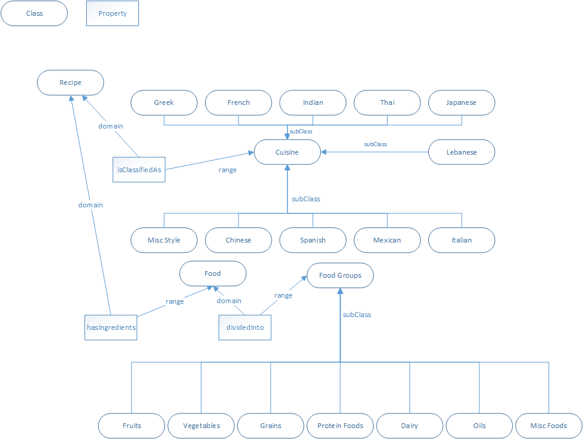

Food Recipe Ontology
====================

Domain: Food Recipes  
Scope: Given what's in the food pantry and what kitchen appliances are available, what meals can be made.  

The following are possible recipe inputs. These are case-sensitive:  
Temp:  
  * Hot
  * Room
  * Cold  
Size:
  * Big
  * Average
  * Small
  * Snack  
Nutritional Value:
  * Healthy
  * Midhealthy
  * Unhealthy  
Cuisine:
  * Greek
  * French
  * Indian
  * Thai
  * Japanese
  * Lebanese
  * Italian
  * Mexican
  * Spanish
  * Chinese
  * MiscStyle  
Takes less than:
  * [any positive integer]  
Difficulty:
  * Easy
  * Medium
  * Hard  
Allergy (this looks for every recipe that doesn't have the entered allergy):
  * Nut
  * Berry
  * Shell
  * Gluten
  * Lactose   
  
